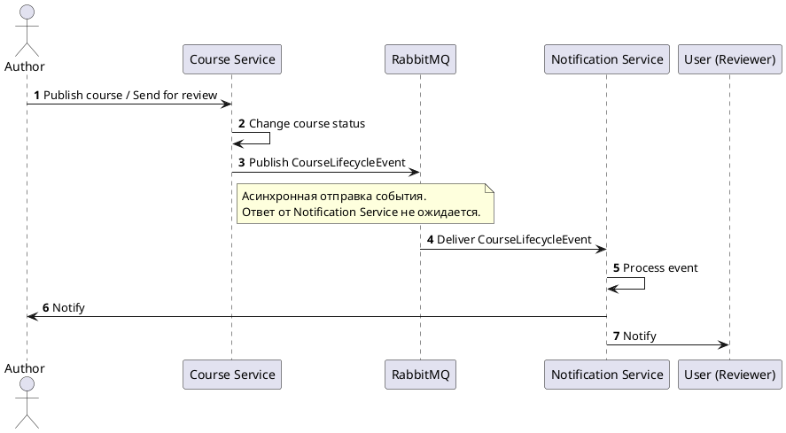

## Сценарий

Асинхронное взаимодействие в системе реализуется между `Course Service` и `Notification Service` в сценарии публикации курса и отправки его на рецензию. После изменения статуса курса сервис публикации отправляет событие в брокер сообщений и не ждёт ответа от сервиса уведомлений. Сервис уведомлений получает событие отдельно и рассылает уведомления автору и рецензентам.



## Выбор технологии

Для данного взаимодействия выбран `RabbitMQ`. Для платформы он подходит лучше всего, потому что событие небольшое, формат обмена JSON, а операция не требует немедленного ответа в рамках пользовательского запроса.

## Контракт AsyncAPI

```yaml
asyncapi: 3.1.0
info:
  title: Course Lifecycle Events API
  version: 1.0.0
  description: События жизненного цикла курса для сервиса уведомлений.
defaultContentType: application/json
servers:
  rabbitmq:
    host: 'rabbitmq:5672'
    protocol: amqp
channels:
  course.lifecycle.events:
    address: course.lifecycle.events
    messages:
      courseLifecycleEvent:
        $ref: '#/components/messages/CourseLifecycleEvent'
components:
  messages:
    CourseLifecycleEvent:
      name: CourseLifecycleEvent
      title: Событие жизненного цикла курса
      payload:
        $ref: '#/components/schemas/CourseLifecycleEvent'
  schemas:
    CourseLifecycleEvent:
      type: object
      required: [eventId, eventType, occurredAt, course, recipients]
      properties:
        eventId:
          type: string
          format: uuid
        eventType:
          type: string
          enum: [course_published, course_sent_for_review]
        occurredAt:
          type: string
          format: date-time
        course:
          type: object
          required: [id, title, authorId, versionId, status]
          properties:
            id:
              type: string
              format: uuid
            title:
              type: string
            authorId:
              type: string
              format: uuid
            versionId:
              type: string
              format: uuid
            status:
              type: string
              enum: [draft, in_review, published]
        recipients:
          type: array
          items:
            type: object
            required: [userId, role]
            properties:
              userId:
                type: string
                format: uuid
              role:
                type: string
                enum: [author, reviewer]
        meta:
          type: object
          properties:
            sourceService:
              type: string
              example: course-service
            idempotencyKey:
              type: string
              format: uuid
```
