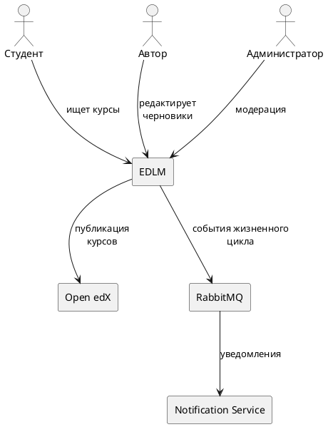

## C1. System Context

```plantuml
@startuml
top to bottom direction
skinparam nodesep 100
skinparam ranksep 100
skinparam shadowing false
skinparam packageStyle rectangle

actor "Студент" as student
actor "Автор" as author
actor "Администратор" as admin

rectangle "EDLM" as edlm
rectangle "Open edX" as openedx
rectangle "Notification Service" as ns
rectangle "RabbitMQ" as mq

student --> edlm : ищет курсы
author --> edlm : "редактирует\nчерновики"
admin --> edlm : модерация

edlm --> openedx : "публикация\nкурсов"
edlm --> mq : "события жизненного\nцикла"
mq --> ns : уведомления

@enduml
````

## C2. Container Diagram

```plantuml
@startuml
top to bottom direction
skinparam nodesep 100
skinparam ranksep 100
skinparam shadowing false
skinparam packageStyle rectangle

rectangle "EDLM Web" as web
rectangle "Docs Site" as docs
rectangle "Course API" as api
rectangle "Content Service" as content
rectangle "Storage" as storage
rectangle "Search Index" as search
rectangle "RabbitMQ" as mq
rectangle "Open edX" as openedx

web --> api : REST
docs --> api : ReDoc
api --> content : черновики, курсы
content --> storage : материалы
content --> search : индекс
content --> mq : события
api --> openedx : публикация

@enduml
```