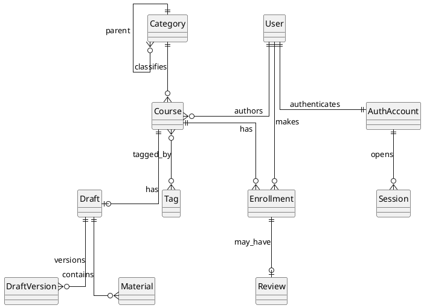

Тип БД реляционный, как было определено в разделе по технологиям хранения данных. ERD реализованы на трёх уровнях: концептуальном, логическом, физическом.

## Концептуальная модель

В системе имеются следующие сущности: пользователь, аккаунт аутентификации, сессия, курс, черновик, версия черновика, материал, запись на курс, отзыв, категория, тег.

Пользователь создаёт курсы, курс имеет черновик, черновик содержит версии и материалы. Пользователь проходит регистрацию и авторизацию через аккаунт и сессии. Пользователь записывается на курс, а отзыв оставляет именно по записи, а не просто по факту просмотра курса. Курс относится к категории и может иметь набор тегов. Автор курса не выносится в отдельную сущность, потому что это тот же пользователь. Один и тот же человек может быть и автором своих курсов, и студентом на чужих курсах, поэтому отдельная сущность автора только дублировала бы данные и усложняла бы авторизацию и связи между сущностями.

## Логическая модель

* Пользователь, AuthAccount, Session, Course, Draft, DraftVersion, Material, Enrollment, Review, Category, Tag.
* Review ссылается на Enrollment, а не на Course напрямую.
* DraftVersion самосвязана через `parent_version_id`.
* Курс ссылается на текущий черновик через `current_draft_id`.

## Физическая модель

* Идентификаторы: `bigserial`.
* Дата: `timestamp`.
* Снимок версии: `jsonb`.
* Перечисления реализованы пользовательскими типами.
* Индексы: по внешним ключам, уникальные на `auth_accounts.login`, `enrollments(user_id, course_id)`, `reviews(enrollment_id)` и др.
